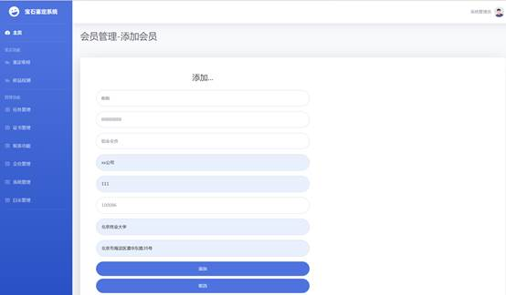

# 如何运行

安装好相关环境(Django)后，运行manage.py，打开浏览器进入运行时给出的网址

**详情内容请参考main目录下的"文档"文件夹内内容**

# 用户操作举例

## 一、管理员

1. 管理员登录：

2.分配任务：

 

 

 

3.打印证书：

 

4.证书作废：

 

5.导出报表：

 

 

 

 

 

 

6.添加会员：

 

 

 

 

 

7.修改会员信息：

 

8.删除会员：

9.系统管理：

## 二、收样员

添加收样单：

 

## 三、检测员

录入检测数据：

 

## 四、审核员

审核样品：

 
